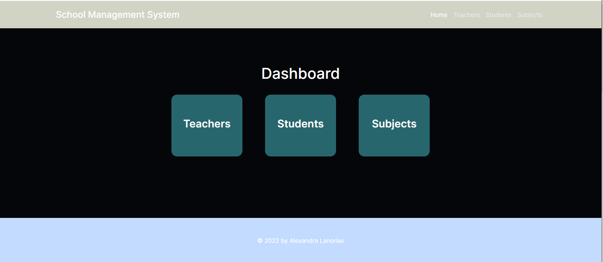
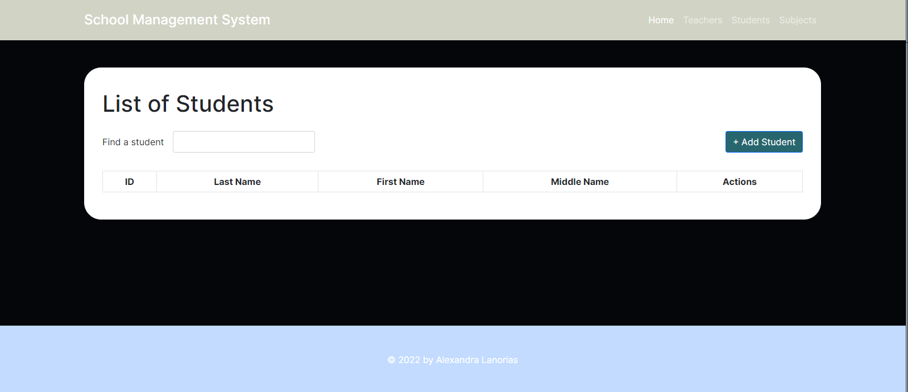
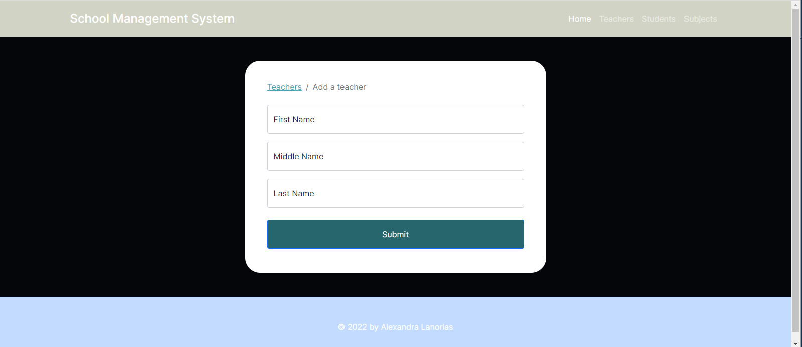
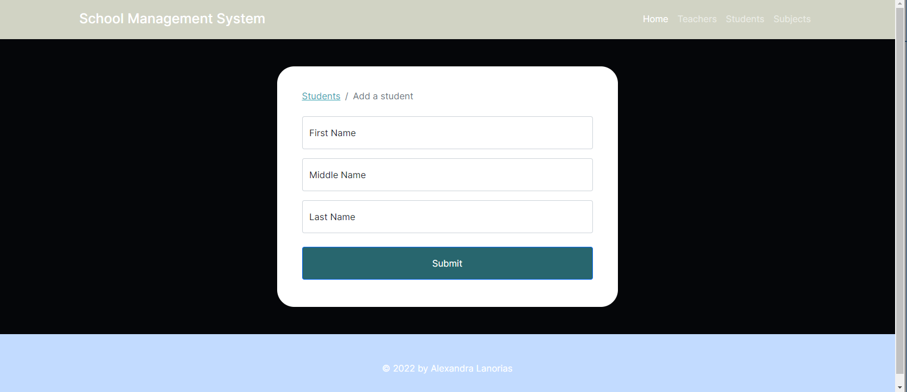
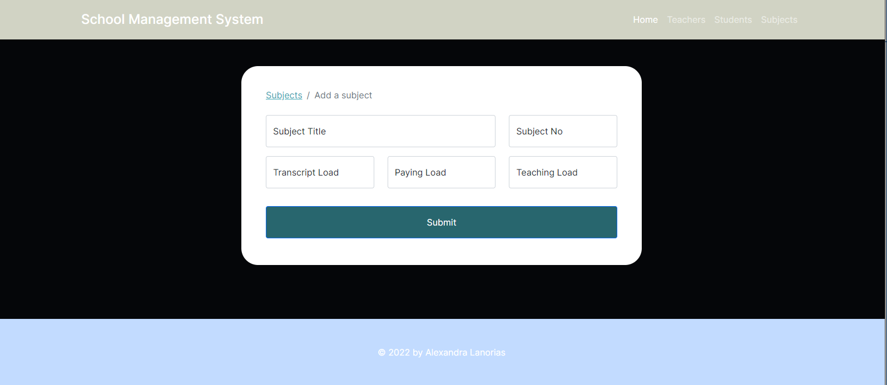
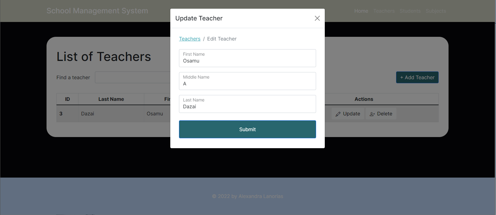
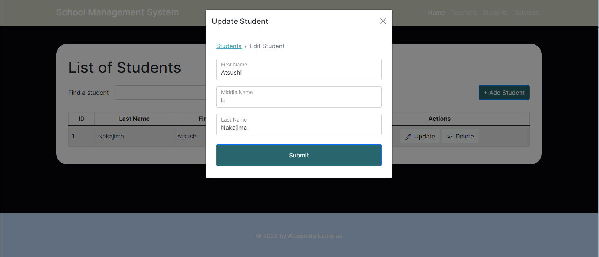
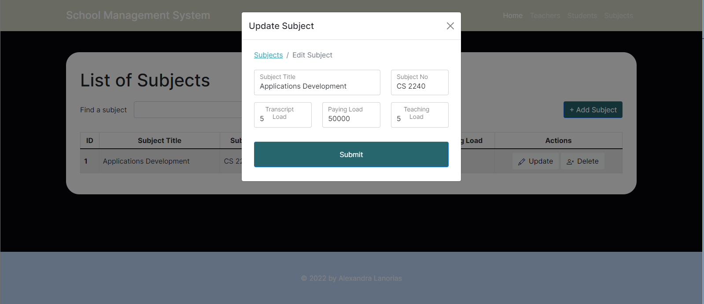

# PAA 4 and FSA for CS 2240
by Alexandra Lanorias

# About
This is a basic CRUD app for a simple school system, consisting of teachers, students, and subjects. Users can add/edit/remove persons and entities from said categories.

# Screenshots

The Main Page


The Teachers Landing Page


The Students Landing Page


The Subjects Landing Page


Add a teacher


Add a student


Add a subject


Edit teacher details


Edit student details


Edit subject details

# How to run this app locally
Sadly, I haven't implemented this in my [main website](https://alexandralanorias.github.io/) as this app is made using Node.JS and Handlebars, among others. But below are the steps to run this app locally in your own computer.

1. First things first, open xampp and start apache and mysql
2. Create a database in localhost/phpmyadmin named school_management_system
3. Copy-paste the queries found in the school-schema.sql file in the sql tab
4. Create a .env file with the following format:

```
DB_HOST = localhost
DB_NAME = school_management_system
DB_USER = root
DB_PASS = ''
```

5. Then edit the .env file according to your username and password that you use in phpmyadmin
6. We'll be using port 5000 for this activity. If your port 5000 is already used go to this app.js file and find 'const PORT = process.env.PORT || 5000;'
7. Edit '5000' with whatever port you want to replace it with
8. Open the lanorias-paa4-fsa folder in your file explorer
9. Shift + Right click and select 'Open powershell windows here'
10. Type 'npm install'
11. You may see '1 high severity vulnerability' after installing, just ignore it as the app will still run
12. Then type 'npm start'
13. You're good to go! You should be seeing the 'Yay, no errors! Try accessing localhost: 5000 on your browser.' notice.
14. Lastly, go check out the CRUD app in your browser by going to localhost:5000 :)
